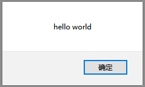
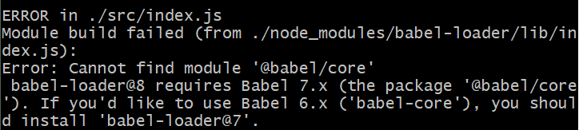
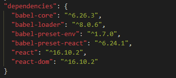
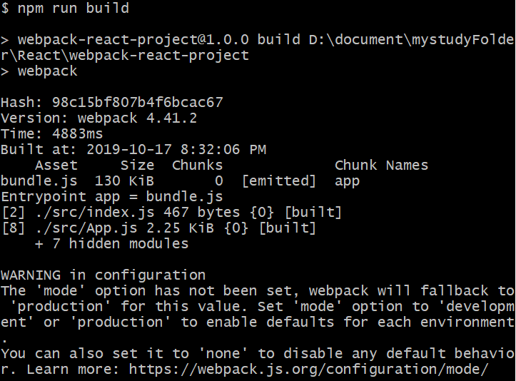
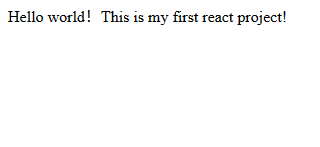
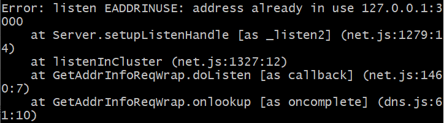

### 一、项目说明

1. 开发环境：windows 10
2. 开发软件：Visual Studio Code V 1.38.1
3. 开发依赖包版本：
   - node：v10.16.0
   - npm：v6.9.0
   - webpack：v4.40.2
   - webpack-cli: v3.3.9
   - react：v16.10.2
   - react-dom: v16.10.2
   - babel-core：v7.1.5
   - babel-loader：v6.26.3
   - babel-preset-env:  v1.7.0
   - babel-preset-react:  v6.24.1

### 二、项目构建

#### 1.项目起步及webpack配置

- 创建项目文件夹并进入

```javascript
mkdir webpack-react-project && cd webpack-react-project
```

- 初始化项目，生成package.json文件

```javascript
npm init -y
```

  	  	-y：package.json中的配置选项采用默认值

  	  	或

```
npm init 
```

  	  	根据提示设置对应配置的取值（回车时默认配置为默认值）

- 局部安装webpack到开发环境

```
npm install --save-dev webpack
npm install --save-dev webpack-cli
```

  	  	前者是webpack的核心库，后者是分离出来的webpack命令行功能，我们需要使用webpack-cli来进行项目的打包等操作 
  	  	备注：--save-dev是开发环境所需要的依赖包，--save是上线所需的依赖包

- 新建webpack.config.js，配置打包入口及出口

  使用以下命令创建该文件或者直接创建该文件均可

```javascript
touch webpack.config.js
```

  	  	文件内容如下：

```javascript
const path = require('path');

module.exports = {
    // 入口文件
    entry: {
        app: './src/index.js'
    },
    // 输出到dist文件夹, 文件名字为bundle.js
    output: {
        filename: 'bundle.js',
        path: path.resolve(__dirname,'./dist')
    }
}
```

- 在根目录下创建src目录，在该目录下创建index.js文件

```javascript
mkdir src && cd src && touch index.js
```

  	  	index.js内容如下：

```javascript
alert('hello world!')
```

- 在package.json文件中加入自定义脚本

```javascript
"scripts": {
    "test": "echo \"Error: no test specified\" && exit 1",
    "build": "webpack"
},
```

- 回到根目录，使用脚本方式进行项目构建

```javascript
npm run build
```

  	  	此时会看到以下内容，表示构建成功


  	  	同时，此时可以看到，在根目录下生成了dist目录，dist目录下有编译输出的bundle.js文件

```javascript
--webpack-react-project
   |--dist(项目打包输出目录)
       |--bundle.js(该文件是由webpack打包生成)
   |--node_modules
       |--依赖包文件
   |--src
       |--index.js
   |--webpack.config.js
   |--package.json
   |--package-lock.json
```

- 在dist目录下新建index.html文件

```html
<!DOCTYPE html>
<html lang="en">
<head>
    <meta charset="UTF-8">
    <title>Title</title>
</head>
<body>
    <div id="root"></div>
    <script src="bundle.js"></script>
</body>
</html>
```


- 使用浏览器打开index.html文件，窗口弹出"hello world"



  

#### 2.React配置

- 安装react和react-dom

```javascript
npm install react react-dom --save
```

- 引入babel库对react中的jsx语法进行转码

```
npm install babel-core babel-loader babel-preset-env babel-preset-react --save
```

  	  	**babel-core:** 核心包，babel-loader的核心依赖

  	  	**babel-loader:** babel加载器

  	  	**babel-preset-env:** 对ES2015及更高版本进行转换，如果仅对ES2015转换，可以使用babel-preset-es2015

  	  	**babel-preset-react:** 将jsx语法转换为js

- 在根目录下创建babel配置文件.babelrc (注意：文件名是.babelrc，.不能缺少)

```
{
    "presets": [
        "env",
        "react"
    ]
}
```

- webpack.config.js文件中新增配置使用babel-loader

```
const path = require('path');

module.exports = {
    // 入口文件
    entry: {
        app: './src/index.js'
    },
    // 输出到dist文件夹, 文件名字为bundle.js
    output: {
        filename: 'bundle.js',
        path: path.resolve(__dirname,'./dist')
    },
    //配置使用babel-loader
    module: {
        rules: [
            {
                test: /\.(js|jsx)$/,
                use: 'babel-loader',
                exclude: /node_modules/
            }
        ]
    }
}
```

- 在src目录下新建App.js文件，创建App组件

```
import React, { Component } from 'react';

class App extends Component {
    render() {
        return (
            <div>
                Hello world！This is my first react project! 
            </div>
        );
    }
}

export default App;
```

- 在src中的index.js中引入App组件

```
import React from 'react';
import ReactDOM from 'react-dom';
import App from './App';

ReactDOM.render(
    <App />,
    document.getElementById('root')
)
```

- 对调整后的代码进行编译构建

```
npm run build
```

  	  	显示编译失败，报错如下



  	  	根据提示信息，可以看出出错是由于babel-loader版本和babel-core版本不兼容造成的，通过查看package.json文件，可以看到我们当前安装的这两个依赖包的版本。



  	  	这个问题可以通过提升babel-core版本至7.x或者降低babel-loader版本至7.x来解决。这里我采用了降低babel-loader版本。

- 安装7.x版本的babel-loader

```
//卸载原来安装的版本
npm uninstall babel-loader
//安装7.x版本
npm install babel-loader@7 --save
```

- 重新执行npm run build进行代码编译，编译成功



  	  	编译提示信息有个警告，建议我们配置一下开发模式，对webpack.config.js文件进行如下调整：

```
const path = require('path');

module.exports = {
	//配置开发模式  development:开发    production:生产
    mode: "development",
    // 入口文件
    entry: {
        app: './src/index.js'
    },
    // 输出到dist文件夹, 文件名字为bundle.js
    output: {
        filename: 'bundle.js',
        path: path.resolve(__dirname,'./dist')
    },
    module: {
        rules: [
            {
                test: /\.(js|jsx)$/,
                use: 'babel-loader',
                exclude: /node_modules/
            }
        ]
    }
}
```

- 重新npm run build，然后使用浏览器打开dist目录下的index.html文件，浏览器显示：



  	  	这样，就完成了引入react的相关配置。

#### 3.配置webpack-dev-serve

  	  	按照前面步骤构建的项目，每次修改后都要手动编译及手动刷新index.html，才能看到修改后的页面效果，开发效率较低。为此，可以使用webpack-dev-server来解决这个问题。

  	  	webpack-dev-server是一个提供实时重加载功能的开发服务器，可以为开发环境下的项目提供自动刷新和Hot Module  Replacement（模块热替换： 在应用程序运行过程中替换、添加或删除[模块](https://www.webpackjs.com/concepts/modules/)，而无需重新加载整个页面 ）。

- 安装webpack-dev-server

```
npm install webpack-dev-server --save-dev
```

- webpack.config.js中增加devServer配置

```
 devServer: {
        port: 3000,         //如果省略，默认8080
        contentBase: './dist'
 }
```

- package.json中新增一个脚本“server”

```
"scripts": {
    "test": "echo \"Error: no test specified\" && exit 1",
    "build": "webpack",
    "server": "webpack-dev-server --open"
},
```

- 执行脚本

```
npm run server
```

  	  	编译成功后，会自动打开浏览器，后面每次更改项目后，webpack都会自动编译和刷新

  	  	备注：如果执行脚本后，出现如下错误信息，则表明配置的3030端口被占用，重新更换一个端口即可

​

- 至此，简单的webpack+react开发环境搭建完毕。

### 三、小结

  	  	源码详见：https://github.com/Snail-Lu/webpack-react-project.git